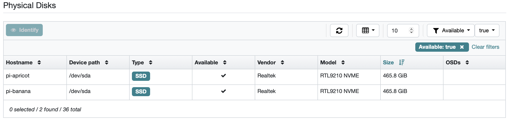

# Ceph v18.2.4

<picture>
  <source media="(prefers-color-scheme: dark)" srcset="/media/CephLogoDark@2x.png">
  <source media="(prefers-color-scheme: light)" srcset="/media/CephLogoLight@2x.png">
  
</picture>

This repository is meant to build a custom Docker image from the original [Ceph](https://github.com/ceph/ceph) Docker image, focused on giving support to run Ceph on Raspberry Pi.

## Patches

### Allow USB devices

This patch allows the use of USB devices as OSDs.

As commented on https://github.com/rook/rook/issues/14699, USB disks are ignored by Ceph because of `id_bus`.

Since https://github.com/ceph/ceph/pull/49954, Ceph does not allow USB devices to be used as OSDs. This patch reverts the changes made in that PR.

For more information, check the [patch](patches/allow-usb-devices.py).
